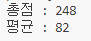
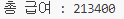
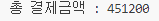
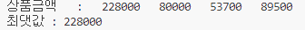
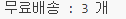
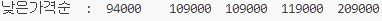
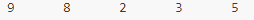

# 이승현 - Java 배열 연습문제
---
> 2024-09-19


## 문제1
```java
public class Exercise_01 {
    public static void main(String[] args) {
        int[] grade = {75,82,91};
        int sum=0;

        for ( int i=0; i<grade.length; i++ ) {
            sum += grade[i];
        }

        int avg = sum / grade.length;

        System.out.printf("총점 : %d\n", sum);
        System.out.printf("평균 : %d\n", avg);
    }
}
```
실행 결과의 스크린샷




## 문제2
```java
public class Exercise_02 {
    public static void main(String[] args) {
        int[] time = {7,5,5,5,5,10,7};
        int money;
        int sum = 0;

        for ( int i=0; i<time.length; i++ ) {
            money = i<4? 4500 : 5200;
            sum += money * time[i];
        }

        System.out.println("총 급여 : " + sum);
    }
}
```
실행 결과의 스크린샷




## 문제3
```java
public class Exercise_03 {
    public static void main(String[] args) {
        int[] price = { 38000, 20000, 17900, 17900 };
        int[] qty = { 6, 4, 3, 5 };
        int money = 0;

        for ( int i=0; i<price.length; i++ ) {
            money += price[i] * qty[i];
        }

        System.out.println("총 결제금액 : " + money);
    }
}
```
실행 결과의 스크린샷




## 문제4
```java
public class Exercise_04 {
    public static void main(String[] args) {
        int[] price = { 38000, 20000, 17900, 17900 };
        int[] qty = { 6, 4, 3, 5 };
        int[] money = new int[4];

        for ( int i=0; i<price.length; i++ ) {
            money[i] = price[i] * qty[i];
        }

        System.out.print("상품금액   :   ");
        for ( int i=0; i<money.length; i++ ) {
            System.out.print( money[i] + "\t" );
        }
        System.out.println();
        
        int max = money[0];

        for ( int i=1; i<money.length; i++ ) {
            if ( max < money[i] ) {
                max = money[i];
            }
        }

        System.out.println("최댓값 : " + max);
    }
}
```
실행 결과의 스크린샷




## 문제5
```java
public class Exercise_05 {
    public static void main(String[] args) {
        int[] price = { 38000, 20000, 17900, 17900 };
        int[] qty = { 6, 4, 3, 5 };
        int[] money = new int[4];
        int cnt = 0;

        for ( int i=0; i<price.length; i++ ) {
            money[i] = price[i] * qty[i];

            cnt = money[i]>=80000? ++cnt : cnt;
        }

        System.out.printf("무료배송 : %d 개\n", cnt);
    }
}
```



## 문제6
```java
public class Exercise_06 {
    public static void main(String[] args) {
        int[] money = {209000,109000,119000,109000,94000};

        for ( int i=0; i<money.length-1; i++ ) {
            for ( int j=i+1; j<money.length; j++ ) {
                if ( money[i] > money[j] ) {
                    int tmp = money[i];
                    money[i] = money[j];
                    money[j] = tmp;
                }
            }
        }

        System.out.print("낮은가격순  :  ");
        for ( int i=0; i<money.length; i++ ) {
            System.out.print(money[i] + "\t");
        }
        System.out.println();
    }
}
```



## 문제7
```java
public class Exercise_07 {
    public static void main(String[] args) {
        int[] arr = {5,3,2,8,9};

        for ( int i=0; i<arr.length/2; i++ ) {
            int k = arr.length-i-1;

            int tmp = arr[i];
            arr[i] = arr[k];
            arr[k] = tmp;
        }

        for ( int i=0; i<arr.length; i++ ) {
            System.out.print(arr[i] + "\t");
        }
        System.out.println();
    }
}
```
실행 결과의 스크린샷




## 문제8
```java
public class Exercise_08 {
    public static void main(String[] args) {
        String[] names = {"재석","민영","종민","광수","승기","새정"};
        int[] points = {82,91,54,62,88,90};

        for ( int i=0; i<points.length-1; i++ ) {
            for ( int j=0; j<points.length-1-i; j++ ) {
                if ( points[j] < points[j+1] ) {
                    int tmp = points[j];
                    points[j] = points[j+1];
                    points[j+1] = tmp;

                    String tmp2 = names[j];
                    names[j] = names[j+1];
                    names[j+1] = tmp2;
                }
            }
        }

        System.out.print("점수 높은 순  :  ");
        for ( int i=0; i<names.length; i++ ) {
            System.out.print(names[i] + "\t");
        }
        System.out.println();
    }
}
```
실행 결과의 스크린샷


## 문제9
```java
public class Exercise_09 {
    public static void main(String[] args) {
        char[] cs = {'1','5','7','J','Q','A'};
        char[] yh = {'2','3','4','5','Q','K','A'};
        //Char[] arr = new Char[yh.length];
        int cnt = 0;

        for ( int i=0; i<yh.length; i++ ) {
            for ( int j=0; j<cs.length; j++ ) {
                if ( yh[i] == cs[j] ) {
                    cnt++;
                }
            }
        }

        System.out.printf("가져올 수 있는 카드의 수 : %d 장\n", cnt);

        for ( int i=0; i<yh.length; i++ ) {
            for ( int j=0; j<cs.length; j++ ) {
                if ( yh[i] == cs[j] ) {
                    System.out.printf("%d번째 >> %s\n", j, cs[j] );
                }
            }
        }

        System.out.println();
        
    }
}
```
실행 결과의 스크린샷


## 문제10
```java
const student = [ "둘리", "도우너", "또치", "희동" ];
const grade = [ 
    [ 78, 89, 96 ], 
    [ 62, 77, 67 ], 
    [ 54, 90, 80 ],
    [ 100, 99, 98 ]
];

const arr = new Array(4);
let total = 0;

for ( let i=0; i<grade.length; i++ ) {
    let sum=0;

    for ( let j=0; j<grade[i].length; j++ ) {
        sum += grade[i][j];
    }

    let avg = sum / grade[i].length;
    //console.log("%s 총점: %d점, 평균: %d점", student[i], sum, avg);
    total += avg;
}
let avg = total/student.length;

console.log("반 평균 : " + avg);
```
실행 결과의 스크린샷


## 문제11
```java
const arr = [
    [ 500, 291 ],
    [ 320, 586 ],
    [ 100, 460 ],
    [ 120, 558 ],
    [ 92, 18 ],
    [ 30, 72 ]
];

let sum = 0;

for ( let i=0; i<arr.length; i++ ) {
    arr[i][0] *= 0.9;

    sum += arr[i][0] * arr[i][1];
}
//console.log(arr);
console.log("아이템의 총 판매가격 : " + sum);
```
실행 결과의 스크린샷


## 문제12
```java
const names = [ "재석", "민영", "종민", "광수", "승기", "새정" ];
const points = [ 82, 91, 54, 62, 88, 90 ];
console.log("이름 : " + names);
console.log("점수 : " + points);

let n = names.length;
const arr = new Array(n);
//console.log(arr);
for ( let i=0; i<names.length; i++ ) {
    arr[i] = [ names[i], points[i] ];
}
console.log("이름, 점수 >> ");
console.log(arr);


for ( let i=0; i<arr.length-1; i++ ) {
    for ( let j=0; j<arr.length-1-i; j++ ) {
        if ( arr[j][1] < arr[j+1][1] ) {
            const tmp = arr[j+1];
            arr[j+1] = arr[j];
            arr[j] = tmp;
        }
    }
}
console.log("점수가 높은 순 >> ");
console.log(arr);

for ( let i=0; i<arr.length; i++ ) {
    console.log("%d등 : %s", i+1, arr[i][0]);
}
```
실행 결과의 스크린샷


## 문제13
```java
const arr = new Array(5);

for ( let i=0; i<arr.length; i++ ) {
    arr[i] = new Array(5);
}

//console.log(arr);


for ( let i=0; i<arr.length; i++ ) {
    for ( let j=0; j<arr[i].length; j++ ) {
        if ( i==j ) {
            arr[i][j] = 1;
        }
        else {
            arr[i][j] = 0;
        }
    }
}
console.log(arr);
```
실행 결과의 스크린샷


## 문제14
```java

const cs = [ 1,5,7,"J","Q","A" ];
const yh = [ 2,3,4,5,"Q","K","A" ];
let n = yh.length;
let arr = new Array(n);

let cnt=0;
for ( let i=0; i<yh.length; i++ ) {
    for ( let j=0; j<cs.length; j++ ) {
        if ( yh[i] == cs[j] ) {
            cnt++;
            arr[j] = [ cs[j] ];
        }
    }
}
//console.log(arr);


console.log("가져올 수 있는 카드의 수 : %d장", cnt );
for ( let i=0; i<arr.length; i++ ) {
    if ( arr[i] != undefined ) {
        console.log("%d번째 >> " + arr[i], i);
    }
} 
```
실행 결과의 스크린샷

