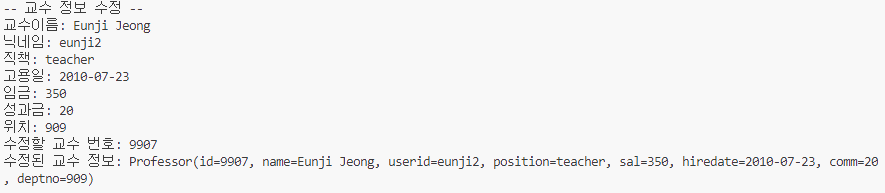

# 이승현 
---
> 2024-10-01


## 연습문제 Professor CRUD


#### 1. Model 클래스

```java
package com.hyeon.model;

import lombok.Data;

@Data
public class Professor {
    private int id;
    private String name;
    private String userid;
    private String position;
    private int sal;
    private String hiredate;
    private Integer comm;
    private int deptno;
}
```

#### 2. Service 인터페이스
```java
package com.hyeon.service;

import java.util.List;

import com.hyeon.model.Professor;

import retrofit2.Call;
import retrofit2.http.DELETE;
import retrofit2.http.Field;
import retrofit2.http.FormUrlEncoded;
import retrofit2.http.GET;
import retrofit2.http.POST;
import retrofit2.http.PUT;
import retrofit2.http.Path;
import retrofit2.http.Query;

public interface ProfessorService {
    public static final String BASE_URL = "http://localhost:3001";

    /**
     * 교수 정보 저장
     * @param name - 이름
     * @param userid - 닉네임
     * @param position - 직책
     * @param sal - 임금
     * @param hiredate - 고용일
     * @param comm - 성과금
     * @param deptno - 위치
     * @return Professor 객체
     */
    @FormUrlEncoded
    @POST("/Professor")    //  ** Create **
    Call<Professor> addProfessor( @Field("name") String name, 
                                @Field("userid") String userid, 
                                @Field("position") String position, 
                                @Field("sal") int sal, 
                                @Field("hiredate") String hiredate, 
                                @Field("comm") Integer comm, 
                                @Field("deptno") int deptno );

    
    /**
     * 교수 정보 조회
     * @param id - 교수번호
     * @return Professor 객체
     */  
    @GET("/Professor/{id}")     // ** Read **
    Call<Professor> getProfessor(@Path("id") int id);

    /**
     * 직책으로 교수 검색
     * @param position - 직책
     * @return Professor List 객체
     */
    @GET("/Professor")      // ** Read **
    Call<List<Professor>> listProfessor(@Query("position_like") String position);

    /**
     * 교수 정보 수정
     * @param id - 교수 번호
     * @param name - 이름
     * @param userid - 닉네임
     * @param position - 직책
     * @param sal - 임금
     * @param hiredate - 고용일
     * @param comm - 성과금
     * @param deptno - 위치
     * @return Professor 객체
     */
    @FormUrlEncoded
    @PUT("/Professor/{id}")     //  ** Update **
    Call<Professor> updateProfessor( @Path("id") int id,
                                    @Field("name") String name, 
                                    @Field("userid") String userid, 
                                    @Field("position") String position, 
                                    @Field("sal") int sal, 
                                    @Field("hiredate") String hiredate, 
                                    @Field("comm") Integer comm, 
                                    @Field("deptno") int deptno );

    /**
     * 교수 정보 삭제
     * @param id - 교수 번호
     * @return Professor 객체
     */                                
    @DELETE("/Professor/{id}")      //  ** Delete **
    Call<Professor> deleteProfessor(@Path("id") int id);
}
```

실행 결과의 스크린샷

### < App01 > 


### < App02 > 


### < App03 > 


### < App04 > 



### < App05 > 


